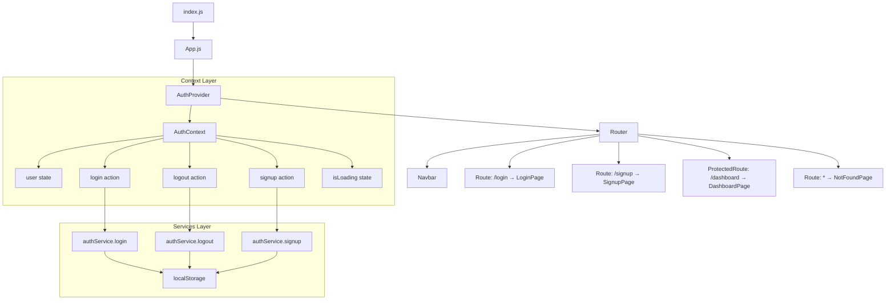
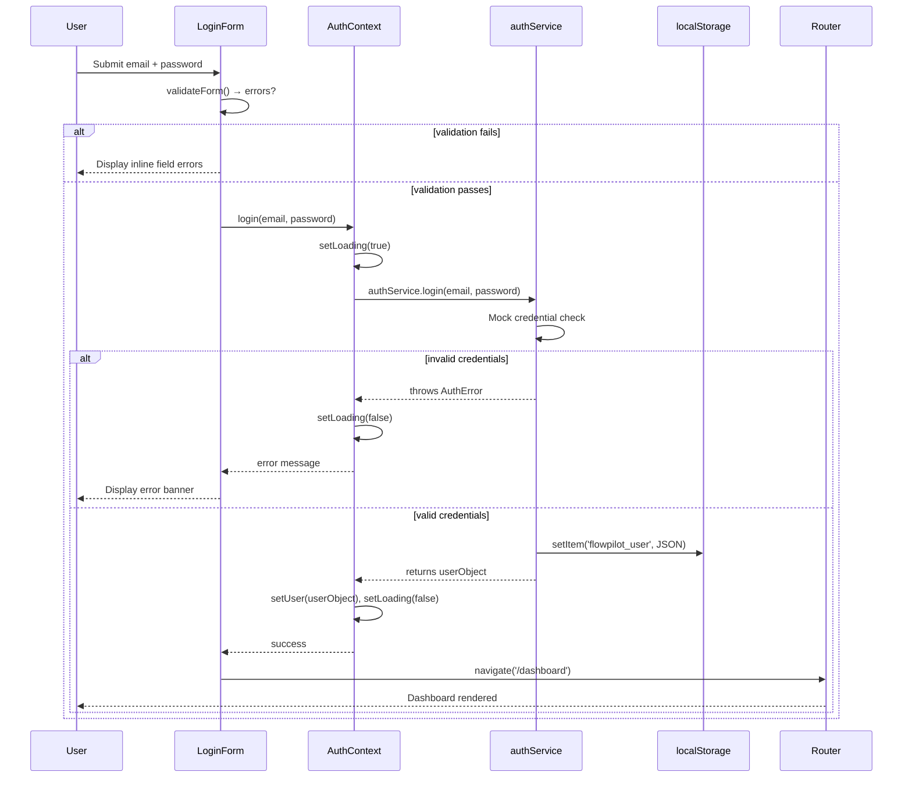
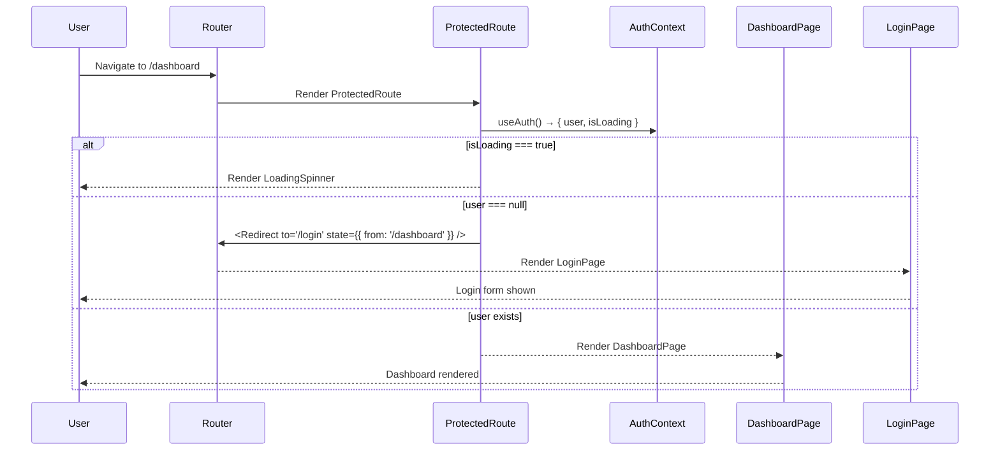
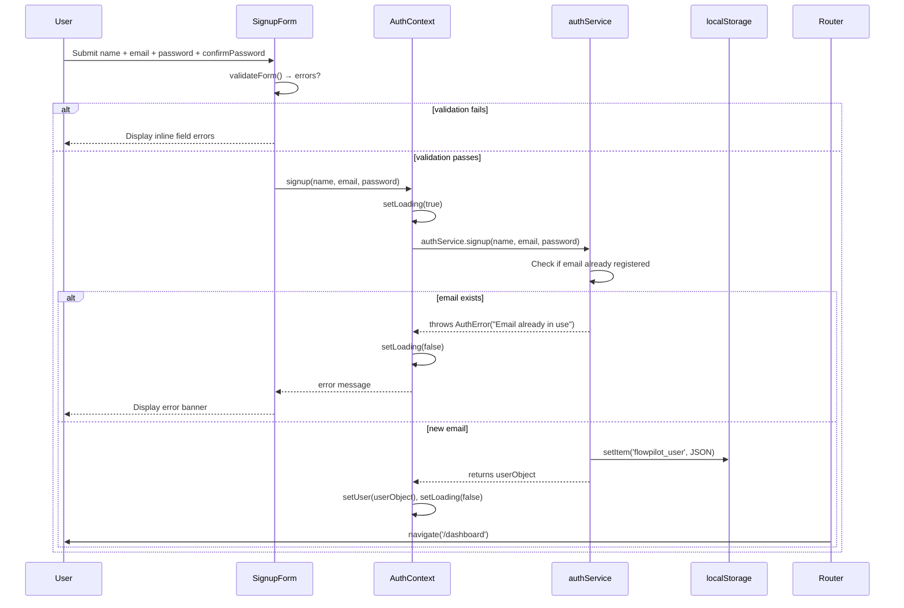

# Design Document: FlowPilot AI — Phase 1

## Overview

FlowPilot AI Phase 1 establishes the foundational production-ready React application shell: a complete project layout, client-side routing, mock authentication with AuthContext, a responsive Navbar, and the four core pages (Login, Signup, Dashboard, NotFound). The stack is constrained to Create React App, JavaScript, React Router DOM v5/v6, Context API, CSS files, and functional components with hooks — no TypeScript, Next.js, Vite, Tailwind, Redux, or Firebase.

The architecture follows a context-driven authentication model: a single `AuthContext` provider wraps the entire app, exposing user state and auth actions. A `ProtectedRoute` component guards the Dashboard, redirecting unauthenticated visitors to `/login`. Mock authentication stores credentials in `localStorage` to survive page refreshes without a real backend.

This phase is entirely self-contained and delivers a working, accessible, mobile-first UI that can be extended in later phases by swapping the mock auth service for real API calls.

---

## Architecture



---

## Sequence Diagrams

### Login Flow



### Protected Route Guard Flow



### Signup Flow



---

## Components and Interfaces

### Component Tree

```
App
└── AuthProvider
    └── Router
        ├── Navbar
        │   ├── NavBrand (logo + title)
        │   ├── NavLinks (desktop links)
        │   └── HamburgerMenu (mobile toggle)
        ├── Switch / Routes
        │   ├── Route /login        → LoginPage
        │   │   └── LoginForm
        │   │       ├── FormField (email)
        │   │       ├── FormField (password)
        │   │       └── SubmitButton
        │   ├── Route /signup       → SignupPage
        │   │   └── SignupForm
        │   │       ├── FormField (name)
        │   │       ├── FormField (email)
        │   │       ├── FormField (password)
        │   │       ├── FormField (confirmPassword)
        │   │       └── SubmitButton
        │   ├── ProtectedRoute /dashboard → DashboardPage
        │   │   ├── DashboardHeader
        │   │   └── DashboardPlaceholder
        │   └── Route *             → NotFoundPage
        └── LoadingSpinner (global overlay when isLoading)
```

### Component: `AuthProvider`

**Purpose**: Wraps the entire app, provides AuthContext value, reads persisted user from localStorage on mount.

**Props**: `{ children: ReactNode }`

**Context Value Shape**:
```javascript
{
  user: null | UserObject,       // null = unauthenticated
  isLoading: boolean,            // true during async auth operations
  error: null | string,          // last auth error message
  login: async (email, password) => void,
  signup: async (name, email, password) => void,
  logout: () => void,
  clearError: () => void
}
```

**Responsibilities**:
- Initialize user from `localStorage` on mount
- Expose `login`, `signup`, `logout` as stable function refs (useCallback)
- Manage `isLoading` and `error` state during auth operations

---

### Component: `ProtectedRoute`

**Purpose**: Route wrapper that redirects unauthenticated users to `/login`.

**Props** (React Router DOM v5 style):
```javascript
{
  component: ReactComponent,  // page component to render
  ...rest                     // all standard Route props (path, exact, etc.)
}
```

**Props** (React Router DOM v6 style):
```javascript
{
  children: ReactNode         // nested <Route> elements or page element
}
```

**Responsibilities**:
- Read `user` and `isLoading` from AuthContext
- Show `LoadingSpinner` while auth state is resolving
- Redirect to `/login` if `user === null`
- Render protected content if `user` exists

---

### Component: `Navbar`

**Purpose**: Top navigation bar with brand, page links, user info, and logout.

**Props**: none (reads from AuthContext and Router)

**Responsibilities**:
- Show brand logo/title always
- Show auth-conditional links: unauthenticated → Login/Signup; authenticated → Dashboard/Logout
- Toggle hamburger menu on mobile (< 768px)
- Close mobile menu on route change
- Highlight active route with `NavLink`

---

### Component: `LoginPage`

**Purpose**: Full-page login form with validation.

**Props**: none (navigates via `useNavigate` / `useHistory`)

**Responsibilities**:
- Controlled form state for `email` and `password`
- Client-side validation before submitting
- Call `AuthContext.login()`
- Display API-level error from context
- Show loading button state
- Redirect to `/dashboard` on success
- Link to `/signup`

---

### Component: `SignupPage`

**Purpose**: Full-page signup form with validation.

**Props**: none

**Responsibilities**:
- Controlled form state for `name`, `email`, `password`, `confirmPassword`
- Client-side validation (matching passwords, email format, min lengths)
- Call `AuthContext.signup()`
- Display API-level error
- Show loading state
- Redirect to `/dashboard` on success
- Link to `/login`

---

### Component: `DashboardPage`

**Purpose**: Authenticated landing page (Phase 1 placeholder).

**Props**: none

**Responsibilities**:
- Display welcome message with `user.name`
- Show placeholder cards for future Phase 2 features
- Provide logout button

---

### Component: `NotFoundPage`

**Purpose**: 404 fallback route.

**Props**: none

**Responsibilities**:
- Display 404 message
- Provide navigation link back to home/dashboard

---

## Data Models

### UserObject

```javascript
// Stored in localStorage and in AuthContext state
{
  id: string,          // e.g. "user_1693000000000"
  name: string,        // display name
  email: string,       // unique identifier for mock auth
  createdAt: string    // ISO 8601 date string
}
```

**Validation Rules**:
- `id` is auto-generated: `"user_" + Date.now()`
- `email` must match RFC 5322 simplified pattern: `/^[^\s@]+@[^\s@]+\.[^\s@]+$/`
- `name` must be 2–50 characters, non-empty
- `password` is never stored in UserObject (mock system only)

---

### AuthState (internal to AuthProvider)

```javascript
{
  user: UserObject | null,   // current authenticated user
  isLoading: boolean,        // pending async operation
  error: string | null       // last error message, cleared on new operation
}
```

---

### MockCredentialsStore (localStorage schema)

```javascript
// Key: 'flowpilot_user'
// Value: JSON-serialized UserObject (current session)

// Key: 'flowpilot_credentials'  
// Value: JSON-serialized array of { email, passwordHash } objects
// Used by authService to validate returning users
[
  { email: string, passwordHash: string }
]
```

---

### FormState (per form component, local state)

```javascript
// LoginPage
{
  values: { email: string, password: string },
  errors: { email: string, password: string },
  isSubmitting: boolean
}

// SignupPage
{
  values: { name: string, email: string, password: string, confirmPassword: string },
  errors: { name: string, email: string, password: string, confirmPassword: string },
  isSubmitting: boolean
}
```

---

## Algorithmic Pseudocode

### Algorithm: `AuthProvider` Initialization

```pascal
PROCEDURE initializeAuthProvider()
  INPUT: none
  OUTPUT: sets user state from persisted storage

  SEQUENCE
    // On component mount (useEffect with empty deps)
    storedUser ← localStorage.getItem('flowpilot_user')
    
    IF storedUser IS NOT NULL THEN
      parsedUser ← JSON.parse(storedUser)
      setUser(parsedUser)
    ELSE
      setUser(null)
    END IF
    
    setIsLoading(false)
  END SEQUENCE
END PROCEDURE
```

**Preconditions**:
- Component has mounted
- localStorage is accessible

**Postconditions**:
- `user` is either a valid `UserObject` or `null`
- `isLoading` is `false`

---

### Algorithm: `authService.login`

```pascal
PROCEDURE mockLogin(email, password)
  INPUT: email: String, password: String
  OUTPUT: UserObject OR throws AuthError

  SEQUENCE
    // Simulate async network delay
    AWAIT delay(600ms)
    
    // Load stored credentials
    storedCreds ← localStorage.getItem('flowpilot_credentials')
    credentials ← IF storedCreds IS NULL THEN [] ELSE JSON.parse(storedCreds)
    
    // Find matching credential entry
    match ← credentials.find(c → c.email EQUALS email)
    
    IF match IS NULL THEN
      THROW AuthError("No account found with this email")
    END IF
    
    // Validate password hash
    inputHash ← simpleHash(password)
    
    IF inputHash NOT EQUALS match.passwordHash THEN
      THROW AuthError("Incorrect password")
    END IF
    
    // Retrieve user object
    storedUser ← localStorage.getItem('flowpilot_user_' + email)
    userObject ← JSON.parse(storedUser)
    
    // Persist current session
    localStorage.setItem('flowpilot_user', JSON.stringify(userObject))
    
    RETURN userObject
  END SEQUENCE
END PROCEDURE
```

**Preconditions**:
- `email` is non-empty string
- `password` is non-empty string

**Postconditions**:
- On success: UserObject returned, session persisted in localStorage
- On failure: AuthError thrown with descriptive message
- No partial state written on failure

---

### Algorithm: `authService.signup`

```pascal
PROCEDURE mockSignup(name, email, password)
  INPUT: name: String, email: String, password: String
  OUTPUT: UserObject OR throws AuthError

  SEQUENCE
    AWAIT delay(800ms)
    
    storedCreds ← localStorage.getItem('flowpilot_credentials')
    credentials ← IF storedCreds IS NULL THEN [] ELSE JSON.parse(storedCreds)
    
    // Check for duplicate email
    existing ← credentials.find(c → c.email EQUALS email)
    
    IF existing IS NOT NULL THEN
      THROW AuthError("An account with this email already exists")
    END IF
    
    // Create new user record
    newUser ← {
      id: "user_" + Date.now(),
      name: name.trim(),
      email: email.toLowerCase().trim(),
      createdAt: new Date().toISOString()
    }
    
    // Hash password (simple mock hash — NOT cryptographically secure)
    passwordHash ← simpleHash(password)
    
    // Persist new credential entry
    credentials.push({ email: newUser.email, passwordHash })
    localStorage.setItem('flowpilot_credentials', JSON.stringify(credentials))
    
    // Persist user object keyed by email
    localStorage.setItem('flowpilot_user_' + newUser.email, JSON.stringify(newUser))
    
    // Set current session
    localStorage.setItem('flowpilot_user', JSON.stringify(newUser))
    
    RETURN newUser
  END SEQUENCE
END PROCEDURE
```

**Preconditions**:
- `name` length ≥ 2
- `email` matches email regex
- `password` length ≥ 6

**Postconditions**:
- On success: new UserObject created and returned, all localStorage keys written atomically
- On failure: AuthError thrown, no localStorage mutation

---

### Algorithm: `authService.logout`

```pascal
PROCEDURE mockLogout()
  INPUT: none
  OUTPUT: none (side effects only)

  SEQUENCE
    // Only remove session — preserve registered credentials
    localStorage.removeItem('flowpilot_user')
  END SEQUENCE
END PROCEDURE
```

**Postconditions**:
- `flowpilot_user` key removed from localStorage
- `flowpilot_credentials` and per-user records preserved (re-login works)

---

### Algorithm: `ProtectedRoute` Guard

```pascal
PROCEDURE ProtectedRoute(props)
  INPUT: { component: Component, ...routeProps }
  OUTPUT: JSX — either Route, Redirect/Navigate, or LoadingSpinner

  SEQUENCE
    { user, isLoading } ← useAuth()

    IF isLoading IS true THEN
      RETURN <LoadingSpinner />
    END IF

    IF user IS NULL THEN
      RETURN <Navigate to="/login" replace state={{ from: location.pathname }} />
    END IF

    RETURN <Component {...routeProps} />
  END SEQUENCE
END PROCEDURE
```

**Preconditions**:
- `AuthProvider` is an ancestor in the React tree
- React Router `Router` is an ancestor

**Postconditions**:
- Unauthenticated users are always redirected — protected content never renders
- `from` state is preserved so login can redirect back after success

---

### Algorithm: Client-Side Form Validation

```pascal
PROCEDURE validateLoginForm(values)
  INPUT: { email: String, password: String }
  OUTPUT: errors object — empty means valid

  SEQUENCE
    errors ← {}

    IF values.email IS EMPTY THEN
      errors.email ← "Email is required"
    ELSE IF values.email DOES NOT MATCH EMAIL_REGEX THEN
      errors.email ← "Enter a valid email address"
    END IF

    IF values.password IS EMPTY THEN
      errors.password ← "Password is required"
    ELSE IF values.password.length < 6 THEN
      errors.password ← "Password must be at least 6 characters"
    END IF

    RETURN errors
  END SEQUENCE
END PROCEDURE

PROCEDURE validateSignupForm(values)
  INPUT: { name, email, password, confirmPassword }
  OUTPUT: errors object — empty means valid

  SEQUENCE
    errors ← {}

    IF values.name.trim() IS EMPTY THEN
      errors.name ← "Name is required"
    ELSE IF values.name.trim().length < 2 THEN
      errors.name ← "Name must be at least 2 characters"
    END IF

    IF values.email IS EMPTY THEN
      errors.email ← "Email is required"
    ELSE IF values.email DOES NOT MATCH EMAIL_REGEX THEN
      errors.email ← "Enter a valid email address"
    END IF

    IF values.password IS EMPTY THEN
      errors.password ← "Password is required"
    ELSE IF values.password.length < 6 THEN
      errors.password ← "Password must be at least 6 characters"
    END IF

    IF values.confirmPassword IS EMPTY THEN
      errors.confirmPassword ← "Please confirm your password"
    ELSE IF values.confirmPassword NOT EQUALS values.password THEN
      errors.confirmPassword ← "Passwords do not match"
    END IF

    RETURN errors
  END SEQUENCE
END PROCEDURE
```

**Postconditions**:
- Returns empty `{}` if and only if all fields are valid
- Each error key maps directly to a form field name for inline display

---

### Algorithm: Navbar Mobile Toggle

```pascal
PROCEDURE Navbar()
  SEQUENCE
    isMenuOpen ← useState(false)
    location ← useLocation()
    { user } ← useAuth()

    // Close mobile menu on route change
    useEffect([location.pathname]:
      setIsMenuOpen(false)
    )

    PROCEDURE toggleMenu()
      setIsMenuOpen(prev → NOT prev)
    END PROCEDURE

    PROCEDURE handleLogout()
      logout()
      navigate('/login')
    END PROCEDURE

    RETURN JSX with:
      - <nav aria-label="main navigation">
      - Brand logo/title
      - Hamburger button (visible on mobile, aria-expanded=isMenuOpen)
      - NavLinks (CSS class "open" when isMenuOpen, hidden on mobile otherwise)
      - Auth links conditional on user
  END SEQUENCE
END PROCEDURE
```

---

## Key Functions with Formal Specifications

### `useAuth()` — Custom Hook

```javascript
// File: src/context/AuthContext/index.js
function useAuth()
```

**Preconditions**:
- Called inside a component that is a descendant of `<AuthProvider>`

**Postconditions**:
- Returns the full AuthContext value (never null)
- Throws descriptive error if used outside AuthProvider

**Loop Invariants**: N/A

---

### `AuthProvider` — Context Provider Component

```javascript
// File: src/context/AuthContext/index.js
function AuthProvider({ children })
```

**Preconditions**:
- `children` is valid React node

**Postconditions**:
- All descendant components can access auth state via `useAuth()`
- User state is hydrated from localStorage before first render completes (avoids flash of unauthenticated state via `isLoading` flag)

---

### `simpleHash(str)` — Mock Password Hash

```javascript
// File: src/services/authService.js
function simpleHash(str)
```

**Preconditions**:
- `str` is a non-empty string

**Postconditions**:
- Returns a deterministic string for the same input
- Different strings produce different outputs with high probability
- NOT cryptographically secure — mock purposes only

**Note**: Uses a basic djb2-style numeric hash converted to base-36 string.

---

### `delay(ms)` — Mock Network Delay

```javascript
// File: src/services/authService.js
function delay(ms)
```

**Postconditions**:
- Returns a Promise that resolves after `ms` milliseconds
- Used to simulate realistic async behavior in mock auth

---

## Example Usage

### Using AuthContext in a component

```javascript
import { useAuth } from '../../context/AuthContext';

function DashboardPage() {
  const { user, logout } = useAuth();

  const handleLogout = () => {
    logout();
    // Router redirect handled by ProtectedRoute re-evaluation
  };

  return (
    <div className="dashboard-container">
      <h1>Welcome, {user.name}!</h1>
      <button onClick={handleLogout}>Logout</button>
    </div>
  );
}
```

### Protecting a route (React Router DOM v5)

```javascript
// App.js — v5 approach
import { Switch, Route } from 'react-router-dom';
import ProtectedRoute from './components/ProtectedRoute';

function App() {
  return (
    <Switch>
      <Route exact path="/login" component={LoginPage} />
      <Route exact path="/signup" component={SignupPage} />
      <ProtectedRoute exact path="/dashboard" component={DashboardPage} />
      <Route component={NotFoundPage} />
    </Switch>
  );
}
```

### Login form submission

```javascript
const handleSubmit = async (e) => {
  e.preventDefault();
  const validationErrors = validateLoginForm(values);
  if (Object.keys(validationErrors).length > 0) {
    setErrors(validationErrors);
    return;
  }
  try {
    await login(values.email, values.password);
    navigate('/dashboard');
  } catch (err) {
    // error is set in AuthContext, read via context.error
  }
};
```

---

## Correctness Properties

### Property 1: Authenticated User Persistence

∀ renders: `user !== null` ⟹ `localStorage.getItem('flowpilot_user')` is non-null. The in-memory auth state and persisted storage are always in sync.

**Validates: Requirements 1.1**

### Property 2: Unauthenticated State Isolation

∀ renders: `user === null` ⟹ no protected content is rendered. Protected routes never expose their content when the user is unauthenticated.

**Validates: Requirements 1.2**

### Property 3: Logout Clears Session

After `logout()`: `user === null` ∧ `localStorage.getItem('flowpilot_user') === null`. Both in-memory state and persisted session are cleared atomically.

**Validates: Requirements 1.3**

### Property 4: Login Sets Correct User

After successful `login(e, p)`: `user.email === e` ∧ `isLoading === false`. The returned user object matches the credentials used to authenticate.

**Validates: Requirements 2.1**

### Property 5: Signup Sets Correct User

After successful `signup(n, e, p)`: `user.email === e` ∧ `user.name === n` ∧ `isLoading === false`. The newly created user object reflects the supplied name and email.

**Validates: Requirements 2.2**

### Property 6: Loading State Always Resolves

`isLoading` transitions: `false → true` (on start) → `false` (on complete or error) — never left as `true`. Every auth operation that sets loading to true must eventually resolve it to false.

**Validates: Requirements 1.4**

### Property 7: Dashboard Route Guard

∀ navigation to `/dashboard`: `user === null` ⟹ redirect to `/login` (Dashboard component never renders). The ProtectedRoute guard unconditionally blocks unauthenticated access.

**Validates: Requirements 3.1**

### Property 8: Auth Pages Redirect Authenticated Users

∀ navigation to `/login` or `/signup`: `user !== null` ⟹ redirect to `/dashboard`. Authenticated users are never shown auth forms.

**Validates: Requirements 3.2**

### Property 9: Session Restored on Refresh

After page refresh with valid localStorage session: `user` is restored before route resolution completes. The `isLoading` flag prevents a flash of the unauthenticated state.

**Validates: Requirements 1.5**

### Property 10: Empty Form Fails Validation

`validateLoginForm({email: '', password: ''})` returns a non-empty errors object. No empty-field submission can reach `authService`.

**Validates: Requirements 4.1**

### Property 11: Mismatched Passwords Fail Validation

`validateSignupForm({..., confirmPassword: 'x', password: 'y'})` always has a `confirmPassword` error when the two password fields differ.

**Validates: Requirements 4.2**

### Property 12: Validation Completeness

Empty `errors` object returned ⟺ all fields pass their respective validation rules. Valid inputs never produce errors; invalid inputs always produce at least one error.

**Validates: Requirements 4.3**

### Property 13: Validation Gates Service Calls

Submitting a form with validation errors does not call `authService`. Client-side validation is always enforced before any async operation is initiated.

**Validates: Requirements 4.4**

---

## Error Handling

### Scenario 1: Invalid Login Credentials

**Condition**: User submits email/password not in mock credentials store  
**Response**: `authService.login` throws `AuthError`; `AuthProvider` catches, sets `error` state  
**UI**: Red error banner rendered above the form; button re-enabled; form not cleared  
**Recovery**: User can retry; `error` is cleared on next submission attempt (`clearError()`)

### Scenario 2: Duplicate Email on Signup

**Condition**: Email already exists in `flowpilot_credentials` localStorage  
**Response**: `authService.signup` throws `AuthError("An account with this email already exists")`  
**UI**: Error banner shown; user redirected to suggest login  
**Recovery**: User can navigate to Login page via link

### Scenario 3: localStorage Unavailable

**Condition**: Browser has `localStorage` disabled (private mode in some browsers, storage quota exceeded)  
**Response**: `try/catch` in authService wraps all localStorage calls; gracefully falls back to session-only in-memory state  
**UI**: Auth works for current session; no persistence warning shown in Phase 1

### Scenario 4: Corrupted localStorage Data

**Condition**: `JSON.parse` fails on stored data  
**Response**: `try/catch` in `AuthProvider` init; corrupt data cleared, user treated as unauthenticated  
**Recovery**: User must log in again; no crash

### Scenario 5: Form Submission During Loading

**Condition**: User clicks submit while `isLoading === true`  
**Response**: Submit button is `disabled` during loading state  
**UI**: Button shows spinner/loading text; cursor `not-allowed`

### Scenario 6: Direct URL Access to Protected Route (Unauthenticated)

**Condition**: User pastes `/dashboard` in address bar without session  
**Response**: `ProtectedRoute` redirects to `/login` with `state.from = '/dashboard'`  
**Recovery**: After login, redirected back to originally requested route

---

## Testing Strategy

### Unit Testing Approach

- `authService.login` / `signup` / `logout` — test with mock localStorage (jest-localstorage-mock)
- `validateLoginForm` / `validateSignupForm` — pure functions, table-driven tests covering all branches
- `simpleHash` — determinism test: same input always produces same output
- `useAuth` — test it throws when called outside `AuthProvider`

### Property-Based Testing Approach

**Property Test Library**: fast-check

- ∀ arbitrary email strings: `validateLoginForm({ email: s, password: 'valid123' })` returns error iff `s` fails email regex
- ∀ non-empty name, valid email, password ≥ 6 chars: `signup` followed by `logout` followed by `login` returns the same user object
- ∀ `password` string: `simpleHash(password) === simpleHash(password)` (determinism)

### Integration Testing Approach

- Full login flow: render `App`, fill Login form, submit → assert redirect to Dashboard
- Full signup flow: render `App`, fill Signup form, submit → assert redirect to Dashboard → user name shown
- Logout flow: render Dashboard → click logout → assert redirect to Login
- ProtectedRoute: navigate to `/dashboard` unauthenticated → assert redirect to `/login`
- Page refresh: set localStorage, render App → assert user restored without flicker

---

## Performance Considerations

- `AuthProvider` uses `useCallback` for `login`, `signup`, `logout` to prevent unnecessary re-renders of consumers
- `AuthContext` value object is memoized with `useMemo` to prevent reference churn
- Navbar uses `React.memo` to avoid re-render on unrelated state changes
- CSS animations (loading spinner, form transitions) use `transform` and `opacity` for GPU compositing
- No code-splitting needed in Phase 1 (small bundle); planned for Phase 2+

---

## Security Considerations

- Passwords are never stored in plaintext — only a mock hash (djb2) is stored. **This is not production-secure** and must be replaced with a real hashing algorithm (bcrypt, Argon2) when a real backend is introduced.
- The `UserObject` stored in localStorage does NOT contain password or hash — only identity fields.
- `localStorage` is susceptible to XSS; a real Phase 2 backend should use `HttpOnly` cookies for session tokens.
- Form inputs are sanitized by React's JSX rendering (XSS via innerHTML is not used).
- All user-facing error messages are generic enough not to leak system internals.
- ARIA attributes and semantic HTML are used throughout to prevent assistive technology from exposing hidden state.

---

## File Structure

```
src/
├── components/
│   ├── Navbar/
│   │   ├── index.js          ← Navbar component
│   │   └── Navbar.css        ← Navbar styles
│   ├── Login/
│   │   ├── index.js          ← LoginPage component
│   │   └── Login.css         ← Login styles
│   ├── Signup/
│   │   ├── index.js          ← SignupPage component
│   │   └── Signup.css        ← Signup styles
│   ├── Dashboard/
│   │   ├── index.js          ← DashboardPage component
│   │   └── Dashboard.css     ← Dashboard styles
│   ├── NotFound/
│   │   ├── index.js          ← NotFoundPage component
│   │   └── NotFound.css      ← NotFound styles
│   └── ProtectedRoute/
│       └── index.js          ← ProtectedRoute wrapper
├── context/
│   └── AuthContext/
│       └── index.js          ← AuthContext + AuthProvider + useAuth
├── services/
│   └── authService.js        ← Mock auth functions + simpleHash + delay
├── utils/
│   └── validators.js         ← validateLoginForm + validateSignupForm
├── App.js                    ← Router setup + route definitions
├── App.css                   ← Global styles + CSS variables
└── index.js                  ← ReactDOM.render entry point
```

---

## Dependencies

| Package | Version | Purpose |
|---|---|---|
| `react` | ^18.x (CRA default) | Core library |
| `react-dom` | ^18.x | DOM rendering |
| `react-router-dom` | ^5.x or ^6.x | Client-side routing |
| `react-scripts` | ^5.x | CRA build toolchain |

No additional runtime dependencies required for Phase 1. All UI is built with vanilla CSS.
