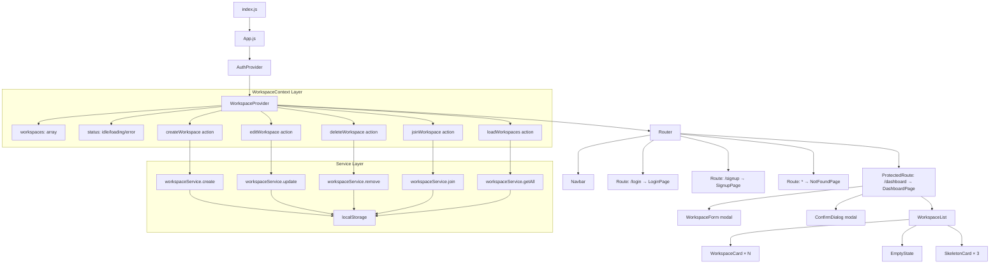
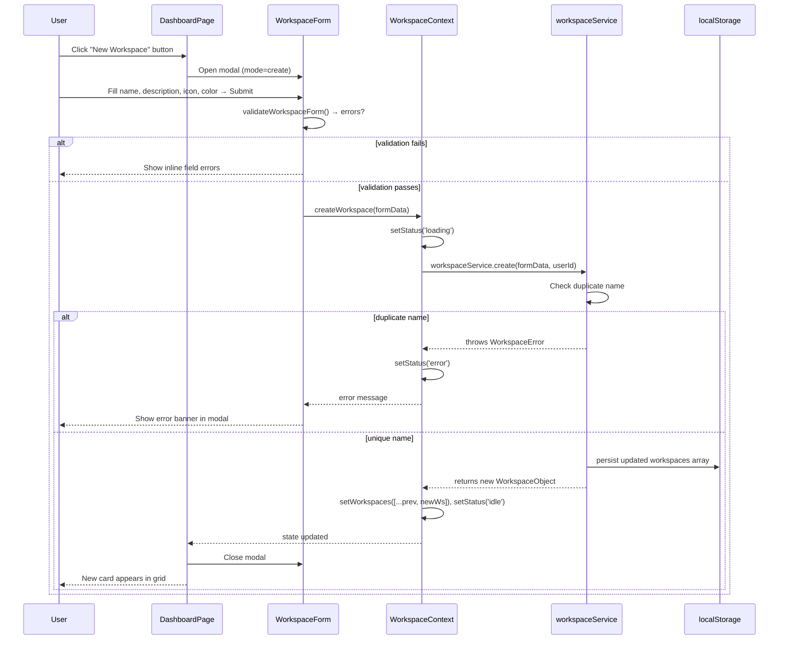
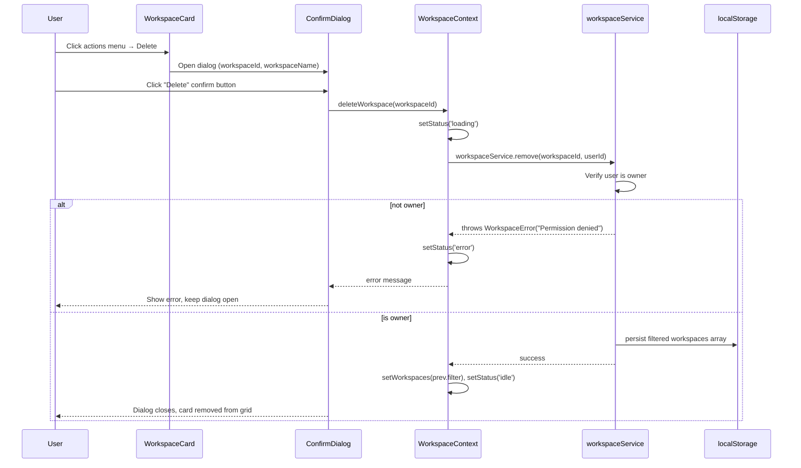
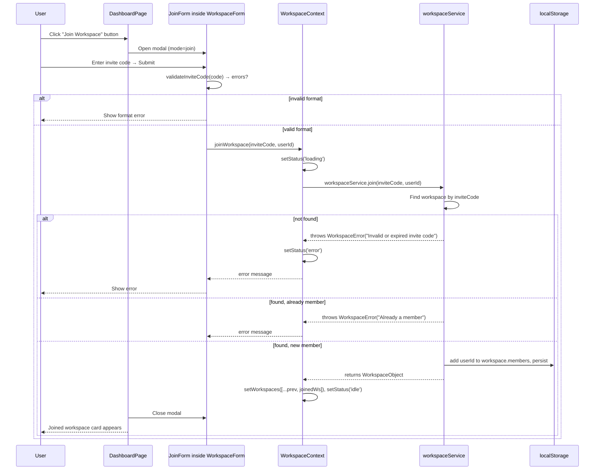

# Design Document: FlowPilot AI — Phase 2 Workspace Management

## Overview

FlowPilot AI Phase 2 extends the authenticated shell from Phase 1 with a full Workspace Management system. Users can create, edit, delete, and join workspaces — all persisted via localStorage through a dedicated `WorkspaceContext`. The Dashboard transforms from a placeholder page into a live workspace hub: a responsive grid of `WorkspaceCard` components, a reusable `WorkspaceForm` modal for create/edit operations, a `ConfirmDialog` for safe deletion, and a join-by-invite-code flow.

The architecture adds a second Context layer (`WorkspaceContext`) that sits inside `AuthContext` and exposes all workspace state and CRUD actions. A `workspaceService` module handles all mock async operations against localStorage, mirroring the pattern established by `authService` in Phase 1. All components are JavaScript functional components with hooks; no TypeScript, Redux, Firebase, or Tailwind is introduced.

Phase 2 is fully backward-compatible with Phase 1: existing routes, AuthContext shape, Navbar, and ProtectedRoute are unchanged. The Dashboard page is upgraded in-place to consume `WorkspaceContext`.

---

## Architecture



---

## Sequence Diagrams

### Create Workspace Flow



### Delete Workspace Flow



### Join Workspace Flow



---

## Component Tree

```
App
└── AuthProvider
    └── WorkspaceProvider          ← NEW: Phase 2 context layer
        └── Router
            ├── Navbar             (unchanged from Phase 1)
            ├── Route /login       → LoginPage (unchanged)
            ├── Route /signup      → SignupPage (unchanged)
            ├── ProtectedRoute /dashboard → DashboardPage (UPGRADED)
            │   ├── DashboardHeader
            │   │   ├── Welcome message (user.name)
            │   │   ├── "New Workspace" button
            │   │   └── "Join Workspace" button
            │   ├── WorkspaceList
            │   │   ├── [loading]  SkeletonCard × 3
            │   │   ├── [empty]    EmptyState
            │   │   └── [data]     WorkspaceCard × N
            │   │       ├── WorkspaceIcon (emoji or colored avatar)
            │   │       ├── WorkspaceMeta (name, description, member count)
            │   │       └── ActionsMenu
            │   │           ├── Edit option
            │   │           └── Delete option (owners only)
            │   ├── WorkspaceForm modal
            │   │   ├── [mode=create] Create form
            │   │   ├── [mode=edit]   Edit form (pre-filled)
            │   │   └── [mode=join]   Join form (invite code field only)
            │   └── ConfirmDialog modal
            │       ├── Warning message
            │       ├── Cancel button
            │       └── Confirm Delete button
            └── Route *            → NotFoundPage (unchanged)
```

---

## Components and Interfaces

### Component: `WorkspaceProvider`

**File**: `src/context/WorkspaceContext/index.js`

**Purpose**: Wraps the authenticated app tree, provides all workspace state and actions via React Context. Loads workspaces for the current user from localStorage on mount and whenever the authenticated user changes.

**Props**: `{ children }`

**Context Value Shape**:

```javascript
{
  workspaces: WorkspaceObject[],   // all workspaces current user owns or is member of
  status: 'idle' | 'loading' | 'error',
  error: string | null,
  createWorkspace: async (formData) => void,
  editWorkspace:   async (id, formData) => void,
  deleteWorkspace: async (id) => void,
  joinWorkspace:   async (inviteCode) => void,
  clearError:      () => void
}
```

**Responsibilities**:
- Read `user` from AuthContext via `useAuth()`
- On `user` change: call `workspaceService.getAll(userId)` → set `workspaces`
- Expose stable action callbacks via `useCallback`
- Memoize context value via `useMemo`

---

### Component: `WorkspaceList`

**File**: `src/components/WorkspaceList/index.js`

**Purpose**: Renders the workspace grid with three visual states: loading (skeleton), empty, and populated.

**Props**: none (reads from `WorkspaceContext`)

**Responsibilities**:
- Observe `status` and `workspaces` from context
- Render `SkeletonCard × 3` when `status === 'loading'`
- Render `EmptyState` when `status === 'idle'` and `workspaces.length === 0`
- Render responsive CSS grid of `WorkspaceCard` components otherwise
- Pass `onEdit` and `onDelete` callbacks down to each card

---

### Component: `WorkspaceCard`

**File**: `src/components/WorkspaceCard/index.js`

**Purpose**: Displays a single workspace with its icon, name, description, member count, and an actions menu.

**Props**:

```javascript
{
  workspace: WorkspaceObject,
  onEdit:    (workspace: WorkspaceObject) => void,
  onDelete:  (workspace: WorkspaceObject) => void
}
```

**Responsibilities**:
- Render colored icon/emoji avatar
- Display name (truncated at 1 line), description (truncated at 2 lines)
- Show member count badge
- Toggle dropdown `ActionsMenu` on kebab-menu click
- Call `onEdit(workspace)` or `onDelete(workspace)` from menu
- Hide "Delete" option if current user is not the owner

---

### Component: `WorkspaceForm`

**File**: `src/components/WorkspaceForm/index.js`

**Purpose**: Reusable modal form that handles Create, Edit, and Join modes. Driven by a `mode` prop.

**Props**:

```javascript
{
  mode:        'create' | 'edit' | 'join',
  workspace:   WorkspaceObject | null,  // required for mode=edit (pre-fill)
  onClose:     () => void,
  onSubmit:    async (formData) => void
}
```

**Responsibilities (create/edit mode)**:
- Render controlled inputs: name, description, icon (emoji picker), color (swatch selector)
- Pre-fill values from `workspace` prop when `mode === 'edit'`
- Run `validateWorkspaceForm()` on submit
- Show per-field inline errors
- Show API-level error banner
- Disable submit button while submitting
- Call `onClose()` on cancel or success

**Responsibilities (join mode)**:
- Render single controlled input: invite code
- Run `validateInviteCode()` on submit
- Show inline and API-level errors

---

### Component: `ConfirmDialog`

**File**: `src/components/ConfirmDialog/index.js`

**Purpose**: Generic confirmation modal used before destructive operations.

**Props**:

```javascript
{
  isOpen:     boolean,
  title:      string,
  message:    string,
  confirmLabel: string,         // default "Delete"
  cancelLabel:  string,         // default "Cancel"
  isDangerous:  boolean,        // renders confirm button in red
  isLoading:    boolean,
  onConfirm:  () => void,
  onCancel:   () => void
}
```

**Responsibilities**:
- Render overlay backdrop + centered dialog
- Trap focus within dialog while open (accessibility)
- Show spinner on confirm button while `isLoading`
- Dismiss on `Escape` key and backdrop click
- Emit `onConfirm` or `onCancel` appropriately

---

## Data Models

### WorkspaceObject

```javascript
// Core workspace entity — stored in localStorage per user
{
  id:          string,      // "ws_" + Date.now() + "_" + random4
  name:        string,      // 3–50 chars, unique per user's workspace list
  description: string,      // 0–200 chars, optional
  icon:        string,      // single emoji character, default "📋"
  color:       string,      // hex color string e.g. "#6366f1", used for avatar background
  inviteCode:  string,      // 8-char alphanumeric, auto-generated on create
  ownerId:     string,      // userId of creator — from AuthContext user.id
  members:     MemberObject[],
  createdAt:   string,      // ISO 8601
  updatedAt:   string       // ISO 8601
}
```

**Validation Rules**:
- `name`: required, 3–50 characters, no leading/trailing whitespace
- `description`: optional, max 200 characters
- `icon`: single emoji or single Unicode character, defaults to `"📋"`
- `color`: valid hex color from allowed palette (6 predefined colors)
- `inviteCode`: auto-generated — `8` uppercase alphanumeric characters
- `ownerId`: must match the currently authenticated `user.id`

---

### MemberObject

```javascript
{
  userId:   string,    // references UserObject.id
  role:     'owner' | 'member',
  joinedAt: string     // ISO 8601
}
```

**Rules**:
- Every workspace has exactly one `role: 'owner'` member (the creator)
- Additional members have `role: 'member'`
- `userId` is unique within a workspace's `members` array

---

### WorkspaceFormData (transient form state)

```javascript
// Create and Edit modes
{
  name:        string,
  description: string,
  icon:        string,
  color:       string
}

// Join mode
{
  inviteCode: string
}
```

---

### LocalStorage Schema

```javascript
// Key: 'flowpilot_workspaces'
// Value: JSON-serialized array of all WorkspaceObjects (global store)
// Rationale: single source of truth; filtered per user at read time
WorkspaceObject[]

// Key: 'flowpilot_user_workspaces_{userId}'
// Value: JSON-serialized array of workspace IDs the user can access
// Used as an index for fast per-user lookup
string[]   // workspace IDs

// Existing Phase 1 keys (unchanged):
// 'flowpilot_user'           → current session UserObject
// 'flowpilot_credentials'    → [{email, passwordHash}]
// 'flowpilot_user_{email}'   → UserObject by email
```

---

### WorkspaceState (internal to WorkspaceProvider)

```javascript
{
  workspaces: WorkspaceObject[],
  status:     'idle' | 'loading' | 'error',
  error:      string | null
}
```

---

## Routing Changes

The Dashboard page is upgraded in-place; no new top-level routes are added in Phase 2. Modals (WorkspaceForm, ConfirmDialog) are rendered as portals or inline conditional elements within DashboardPage — no separate routes needed.

```javascript
// App.js — unchanged route table from Phase 1
// DashboardPage internally manages modal open/close state

// Phase 2 UI state within DashboardPage (local state, not routed):
{
  modalMode:         null | 'create' | 'edit' | 'join',
  editingWorkspace:  null | WorkspaceObject,
  deletingWorkspace: null | WorkspaceObject,
  isConfirmOpen:     boolean
}
```

The Navbar receives one new link addition for authenticated users: a subtle workspace count badge can be optionally added in a later iteration. No Navbar structural changes are required in Phase 2.

---

## Algorithmic Pseudocode

### Algorithm: `WorkspaceProvider` Initialization

```pascal
PROCEDURE initializeWorkspaceProvider()
  INPUT: none (reads user from AuthContext)
  OUTPUT: sets workspaces state from persisted storage

  SEQUENCE
    { user } ← useAuth()

    useEffect([user]:
      IF user IS NULL THEN
        setWorkspaces([])
        setStatus('idle')
        RETURN
      END IF

      setStatus('loading')

      TRY
        workspaces ← AWAIT workspaceService.getAll(user.id)
        setWorkspaces(workspaces)
        setStatus('idle')
      CATCH error
        setError(error.message)
        setStatus('error')
      END TRY
    )
  END SEQUENCE
END PROCEDURE
```

**Preconditions**: `AuthProvider` is ancestor; `user` is either null or valid UserObject
**Postconditions**: `workspaces` reflects all workspaces accessible to the current user; `status` is 'idle' or 'error'

---

### Algorithm: `workspaceService.getAll`

```pascal
PROCEDURE getAllWorkspaces(userId)
  INPUT: userId: String
  OUTPUT: WorkspaceObject[] (filtered for user)

  SEQUENCE
    AWAIT delay(300ms)

    raw ← localStorage.getItem('flowpilot_workspaces')
    all ← IF raw IS NULL THEN [] ELSE JSON.parse(raw)

    // Return workspaces where user is owner OR member
    accessible ← all.filter(ws →
      ws.ownerId EQUALS userId
      OR ws.members.some(m → m.userId EQUALS userId)
    )

    RETURN accessible
  END SEQUENCE
END PROCEDURE
```

**Postconditions**: Returns only workspaces the user has access to; never throws on empty store

---

### Algorithm: `workspaceService.create`

```pascal
PROCEDURE createWorkspace(formData, userId)
  INPUT: formData: WorkspaceFormData, userId: String
  OUTPUT: WorkspaceObject OR throws WorkspaceError

  SEQUENCE
    AWAIT delay(500ms)

    raw ← localStorage.getItem('flowpilot_workspaces')
    all ← IF raw IS NULL THEN [] ELSE JSON.parse(raw)

    // Duplicate name check (case-insensitive, per owner)
    ownerWorkspaces ← all.filter(ws → ws.ownerId EQUALS userId)
    duplicate ← ownerWorkspaces.find(ws →
      ws.name.toLowerCase() EQUALS formData.name.trim().toLowerCase()
    )

    IF duplicate IS NOT NULL THEN
      THROW WorkspaceError("A workspace with this name already exists")
    END IF

    // Build new workspace object
    newWorkspace ← {
      id:          "ws_" + Date.now() + "_" + generateRandom4(),
      name:        formData.name.trim(),
      description: formData.description.trim(),
      icon:        formData.icon OR "📋",
      color:       formData.color OR "#6366f1",
      inviteCode:  generateInviteCode(),
      ownerId:     userId,
      members:     [{ userId: userId, role: 'owner', joinedAt: NOW_ISO }],
      createdAt:   NOW_ISO,
      updatedAt:   NOW_ISO
    }

    // Persist
    all.push(newWorkspace)
    localStorage.setItem('flowpilot_workspaces', JSON.stringify(all))

    RETURN newWorkspace
  END SEQUENCE
END PROCEDURE
```

**Preconditions**: `formData.name` passes validation; `userId` is non-empty
**Postconditions**: On success — new workspace in localStorage, returned; on failure — no mutation

---

### Algorithm: `workspaceService.update`

```pascal
PROCEDURE updateWorkspace(workspaceId, formData, userId)
  INPUT: workspaceId: String, formData: WorkspaceFormData, userId: String
  OUTPUT: WorkspaceObject OR throws WorkspaceError

  SEQUENCE
    AWAIT delay(400ms)

    raw ← localStorage.getItem('flowpilot_workspaces')
    all ← IF raw IS NULL THEN [] ELSE JSON.parse(raw)

    idx ← all.findIndex(ws → ws.id EQUALS workspaceId)

    IF idx EQUALS -1 THEN
      THROW WorkspaceError("Workspace not found")
    END IF

    target ← all[idx]

    IF target.ownerId NOT EQUALS userId THEN
      THROW WorkspaceError("Permission denied: only the owner can edit this workspace")
    END IF

    // Duplicate name check excluding current workspace
    duplicate ← all.find(ws →
      ws.id NOT EQUALS workspaceId
      AND ws.ownerId EQUALS userId
      AND ws.name.toLowerCase() EQUALS formData.name.trim().toLowerCase()
    )

    IF duplicate IS NOT NULL THEN
      THROW WorkspaceError("A workspace with this name already exists")
    END IF

    // Apply updates
    all[idx] ← {
      ...target,
      name:        formData.name.trim(),
      description: formData.description.trim(),
      icon:        formData.icon,
      color:       formData.color,
      updatedAt:   NOW_ISO
    }

    localStorage.setItem('flowpilot_workspaces', JSON.stringify(all))

    RETURN all[idx]
  END SEQUENCE
END PROCEDURE
```

**Preconditions**: Caller is authenticated owner; `formData` passes validation
**Postconditions**: Workspace at `workspaceId` reflects new values; `updatedAt` is refreshed

---

### Algorithm: `workspaceService.remove`

```pascal
PROCEDURE removeWorkspace(workspaceId, userId)
  INPUT: workspaceId: String, userId: String
  OUTPUT: void OR throws WorkspaceError

  SEQUENCE
    AWAIT delay(400ms)

    raw ← localStorage.getItem('flowpilot_workspaces')
    all ← IF raw IS NULL THEN [] ELSE JSON.parse(raw)

    target ← all.find(ws → ws.id EQUALS workspaceId)

    IF target IS NULL THEN
      THROW WorkspaceError("Workspace not found")
    END IF

    IF target.ownerId NOT EQUALS userId THEN
      THROW WorkspaceError("Permission denied: only the owner can delete this workspace")
    END IF

    filtered ← all.filter(ws → ws.id NOT EQUALS workspaceId)
    localStorage.setItem('flowpilot_workspaces', JSON.stringify(filtered))
  END SEQUENCE
END PROCEDURE
```

**Postconditions**: Workspace removed from localStorage; all member references implicitly removed with it

---

### Algorithm: `workspaceService.join`

```pascal
PROCEDURE joinWorkspace(inviteCode, userId)
  INPUT: inviteCode: String, userId: String
  OUTPUT: WorkspaceObject OR throws WorkspaceError

  SEQUENCE
    AWAIT delay(500ms)

    raw ← localStorage.getItem('flowpilot_workspaces')
    all ← IF raw IS NULL THEN [] ELSE JSON.parse(raw)

    // Find workspace by invite code (case-insensitive)
    target ← all.find(ws →
      ws.inviteCode.toUpperCase() EQUALS inviteCode.trim().toUpperCase()
    )

    IF target IS NULL THEN
      THROW WorkspaceError("Invalid invite code — no matching workspace found")
    END IF

    // Check if already a member
    alreadyMember ← target.members.some(m → m.userId EQUALS userId)

    IF alreadyMember THEN
      THROW WorkspaceError("You are already a member of this workspace")
    END IF

    // Add user as member
    newMember ← { userId: userId, role: 'member', joinedAt: NOW_ISO }
    target.members.push(newMember)
    target.updatedAt ← NOW_ISO

    // Persist
    idx ← all.findIndex(ws → ws.id EQUALS target.id)
    all[idx] ← target
    localStorage.setItem('flowpilot_workspaces', JSON.stringify(all))

    RETURN target
  END SEQUENCE
END PROCEDURE
```

**Preconditions**: `inviteCode` passes format validation; `userId` is non-empty
**Postconditions**: User added to workspace.members; workspace returned with updated members array

---

### Algorithm: WorkspaceContext Actions (Provider-Level)

```pascal
PROCEDURE createWorkspace(formData)
  INPUT: formData: WorkspaceFormData
  SEQUENCE
    TRY
      setStatus('loading'), clearError()
      newWs ← AWAIT workspaceService.create(formData, user.id)
      setWorkspaces(prev → [...prev, newWs])
      setStatus('idle')
    CATCH err
      setError(err.message)
      setStatus('error')
    END TRY
  END SEQUENCE
END PROCEDURE

PROCEDURE editWorkspace(id, formData)
  INPUT: id: String, formData: WorkspaceFormData
  SEQUENCE
    TRY
      setStatus('loading'), clearError()
      updatedWs ← AWAIT workspaceService.update(id, formData, user.id)
      setWorkspaces(prev → prev.map(ws →
        IF ws.id EQUALS id THEN updatedWs ELSE ws
      ))
      setStatus('idle')
    CATCH err
      setError(err.message)
      setStatus('error')
    END TRY
  END SEQUENCE
END PROCEDURE

PROCEDURE deleteWorkspace(id)
  INPUT: id: String
  SEQUENCE
    TRY
      setStatus('loading'), clearError()
      AWAIT workspaceService.remove(id, user.id)
      setWorkspaces(prev → prev.filter(ws → ws.id NOT EQUALS id))
      setStatus('idle')
    CATCH err
      setError(err.message)
      setStatus('error')
    END TRY
  END SEQUENCE
END PROCEDURE

PROCEDURE joinWorkspace(inviteCode)
  INPUT: inviteCode: String
  SEQUENCE
    TRY
      setStatus('loading'), clearError()
      joinedWs ← AWAIT workspaceService.join(inviteCode, user.id)
      setWorkspaces(prev → [...prev, joinedWs])
      setStatus('idle')
    CATCH err
      setError(err.message)
      setStatus('error')
    END TRY
  END SEQUENCE
END PROCEDURE
```

**Loop Invariants for all actions**: `workspaces` array only contains valid WorkspaceObjects at every point between state updates (never partially mutated in-flight).

---

### Algorithm: Form Validation

```pascal
PROCEDURE validateWorkspaceForm(values)
  INPUT: { name: String, description: String, icon: String, color: String }
  OUTPUT: errors object — empty means valid

  SEQUENCE
    errors ← {}

    IF values.name.trim() IS EMPTY THEN
      errors.name ← "Workspace name is required"
    ELSE IF values.name.trim().length < 3 THEN
      errors.name ← "Name must be at least 3 characters"
    ELSE IF values.name.trim().length > 50 THEN
      errors.name ← "Name must be 50 characters or fewer"
    END IF

    IF values.description.length > 200 THEN
      errors.description ← "Description must be 200 characters or fewer"
    END IF

    // icon and color have safe defaults so are not required

    RETURN errors
  END SEQUENCE
END PROCEDURE

PROCEDURE validateInviteCode(code)
  INPUT: code: String
  OUTPUT: errors object — empty means valid

  CONST INVITE_CODE_REGEX ← /^[A-Z0-9]{8}$/i
  // 8 alphanumeric characters, case-insensitive

  SEQUENCE
    errors ← {}

    IF code.trim() IS EMPTY THEN
      errors.inviteCode ← "Invite code is required"
    ELSE IF NOT INVITE_CODE_REGEX.test(code.trim()) THEN
      errors.inviteCode ← "Invite code must be 8 letters or numbers (e.g. AB12CD34)"
    END IF

    RETURN errors
  END SEQUENCE
END PROCEDURE
```

**Postconditions**: Returns empty `{}` iff all fields are valid; each key maps to a form field name

---

### Algorithm: Invite Code Generation

```pascal
FUNCTION generateInviteCode()
  INPUT: none
  OUTPUT: 8-character uppercase alphanumeric string

  SEQUENCE
    CONST chars ← "ABCDEFGHIJKLMNOPQRSTUVWXYZ0123456789"
    code ← ""

    FOR i ← 0 TO 7 DO
      randomIndex ← Math.floor(Math.random() * chars.length)
      code ← code + chars[randomIndex]
    END FOR

    RETURN code
  END SEQUENCE
END FUNCTION
```

**Postconditions**: Always returns exactly 8 characters; character space is 36^8 ≈ 2.8 trillion possibilities

---

### Algorithm: DashboardPage Modal State Management

```pascal
PROCEDURE DashboardPage()
  SEQUENCE
    { workspaces, status, createWorkspace, editWorkspace,
      deleteWorkspace, joinWorkspace } ← useWorkspace()
    { user } ← useAuth()

    // Local UI state — not in context
    modalMode         ← useState(null)         // null | 'create' | 'edit' | 'join'
    editingWorkspace  ← useState(null)         // WorkspaceObject | null
    deletingWorkspace ← useState(null)         // WorkspaceObject | null
    isConfirmOpen     ← useState(false)

    PROCEDURE handleOpenCreate()
      setModalMode('create')
      setEditingWorkspace(null)
    END PROCEDURE

    PROCEDURE handleOpenEdit(workspace)
      setEditingWorkspace(workspace)
      setModalMode('edit')
    END PROCEDURE

    PROCEDURE handleOpenDelete(workspace)
      setDeletingWorkspace(workspace)
      setIsConfirmOpen(true)
    END PROCEDURE

    PROCEDURE handleCloseModal()
      setModalMode(null)
      setEditingWorkspace(null)
    END PROCEDURE

    PROCEDURE handleFormSubmit(formData)
      IF modalMode EQUALS 'create' THEN
        AWAIT createWorkspace(formData)
      ELSE IF modalMode EQUALS 'edit' THEN
        AWAIT editWorkspace(editingWorkspace.id, formData)
      ELSE IF modalMode EQUALS 'join' THEN
        AWAIT joinWorkspace(formData.inviteCode)
      END IF
      handleCloseModal()
    END PROCEDURE

    PROCEDURE handleConfirmDelete()
      AWAIT deleteWorkspace(deletingWorkspace.id)
      setIsConfirmOpen(false)
      setDeletingWorkspace(null)
    END PROCEDURE

    RETURN JSX rendering WorkspaceList, conditionally WorkspaceForm, conditionally ConfirmDialog
  END SEQUENCE
END PROCEDURE
```

---

## Key Functions with Formal Specifications

### `useWorkspace()` — Custom Hook

```javascript
// File: src/context/WorkspaceContext/index.js
function useWorkspace()
```

**Preconditions**: Called inside a component descended from `<WorkspaceProvider>`
**Postconditions**: Returns full WorkspaceContext value; throws descriptive error if used outside provider
**Loop Invariants**: N/A

---

### `workspaceService.create(formData, userId)`

**Preconditions**:
- `formData.name` is non-empty, 3–50 chars
- `userId` is a non-empty string matching a valid user
- No existing workspace with same normalized name owned by `userId`

**Postconditions**:
- New WorkspaceObject exists in `localStorage['flowpilot_workspaces']`
- Returned object has `ownerId === userId`, `members.length === 1`, `members[0].role === 'owner'`
- `inviteCode` is exactly 8 uppercase alphanumeric characters

---

### `workspaceService.update(id, formData, userId)`

**Preconditions**:
- Workspace with `id` exists
- `userId === workspace.ownerId`
- `formData.name` is non-empty, 3–50 chars
- No other workspace owned by `userId` has the same normalized name

**Postconditions**:
- Workspace at `id` has updated `name`, `description`, `icon`, `color`, `updatedAt`
- `inviteCode`, `ownerId`, `members`, `createdAt` are unchanged

---

### `workspaceService.remove(id, userId)`

**Preconditions**:
- Workspace with `id` exists
- `userId === workspace.ownerId`

**Postconditions**:
- Workspace with `id` no longer exists in localStorage store
- All other workspaces are unchanged

---

### `workspaceService.join(inviteCode, userId)`

**Preconditions**:
- `inviteCode` matches `/^[A-Z0-9]{8}$/i`
- A workspace with matching `inviteCode` exists
- `userId` is not already in `workspace.members`

**Postconditions**:
- `workspace.members` contains a new entry `{ userId, role: 'member', joinedAt }`
- Returned workspace has updated `members` and `updatedAt`
- `workspace.ownerId` and `inviteCode` are unchanged

---

### `validateWorkspaceForm(values)` — Pure Validation Function

```javascript
// File: src/utils/validators.js
function validateWorkspaceForm(values)
```

**Preconditions**: `values` is an object with `name`, `description` string fields
**Postconditions**: Returns `{}` iff all fields pass; non-empty errors object otherwise; pure — no side effects

---

### `validateInviteCode(code)` — Pure Validation Function

```javascript
// File: src/utils/validators.js
function validateInviteCode(code)
```

**Preconditions**: `code` is a string (may be empty)
**Postconditions**: Returns `{}` iff `code` matches `/^[A-Z0-9]{8}$/i`; error on empty or wrong format

---

## Example Usage

### Consuming WorkspaceContext in DashboardPage

```javascript
import { useWorkspace } from '../../context/WorkspaceContext';
import { useAuth } from '../../context/AuthContext';

function DashboardPage() {
  const { workspaces, status, createWorkspace } = useWorkspace();
  const { user } = useAuth();

  const handleCreate = async (formData) => {
    await createWorkspace(formData);
    // context updates workspaces array; component re-renders automatically
  };

  return (
    <div className="dashboard-container">
      <h1>Welcome, {user.name}</h1>
      <WorkspaceList onEdit={handleOpenEdit} onDelete={handleOpenDelete} />
      {modalMode === 'create' && (
        <WorkspaceForm mode="create" onClose={handleClose} onSubmit={handleCreate} />
      )}
    </div>
  );
}
```

### WorkspaceCard actions wiring

```javascript
function WorkspaceCard({ workspace, onEdit, onDelete }) {
  const { user } = useAuth();
  const isOwner = workspace.ownerId === user.id;

  return (
    <div className="workspace-card">
      <div className="card-icon" style={{ backgroundColor: workspace.color }}>
        {workspace.icon}
      </div>
      <div className="card-body">
        <h3 className="card-name">{workspace.name}</h3>
        <p className="card-desc">{workspace.description}</p>
        <span className="member-count">{workspace.members.length} member(s)</span>
      </div>
      <div className="card-actions">
        <button onClick={() => onEdit(workspace)}>Edit</button>
        {isOwner && (
          <button className="btn-danger" onClick={() => onDelete(workspace)}>
            Delete
          </button>
        )}
      </div>
    </div>
  );
}
```

### WorkspaceForm join mode

```javascript
function WorkspaceForm({ mode, workspace, onClose, onSubmit }) {
  const [inviteCode, setInviteCode] = React.useState('');
  const [errors, setErrors] = React.useState({});

  const handleJoinSubmit = async (e) => {
    e.preventDefault();
    const validationErrors = validateInviteCode(inviteCode);
    if (Object.keys(validationErrors).length > 0) {
      setErrors(validationErrors);
      return;
    }
    await onSubmit({ inviteCode });
  };

  if (mode === 'join') {
    return (
      <div className="modal-overlay">
        <form className="workspace-form" onSubmit={handleJoinSubmit}>
          <h2>Join a Workspace</h2>
          <label htmlFor="inviteCode">Invite Code</label>
          <input
            id="inviteCode"
            value={inviteCode}
            onChange={(e) => setInviteCode(e.target.value.toUpperCase())}
            placeholder="e.g. AB12CD34"
            maxLength={8}
          />
          {errors.inviteCode && (
            <span className="field-error">{errors.inviteCode}</span>
          )}
          <div className="form-actions">
            <button type="button" onClick={onClose}>Cancel</button>
            <button type="submit">Join</button>
          </div>
        </form>
      </div>
    );
  }
  // ... create/edit mode rendering
}
```

### ConfirmDialog usage

```javascript
<ConfirmDialog
  isOpen={isConfirmOpen}
  title="Delete Workspace"
  message={`Are you sure you want to delete "${deletingWorkspace?.name}"? This action cannot be undone.`}
  confirmLabel="Delete"
  isDangerous={true}
  isLoading={status === 'loading'}
  onConfirm={handleConfirmDelete}
  onCancel={() => setIsConfirmOpen(false)}
/>
```

---

## Correctness Properties

### Property 1: Workspace Isolation Per User

∀ userId: `workspaceService.getAll(userId)` returns only workspaces where `ws.ownerId === userId` OR `ws.members.some(m => m.userId === userId)`. No user ever sees a workspace they don't belong to.

**Validates: Requirements 1.1**

### Property 2: Owner-Only Mutation

∀ workspace `ws`, ∀ userId: `update(ws.id, _, userId)` and `remove(ws.id, userId)` succeed iff `ws.ownerId === userId`. Non-owners can never modify or delete a workspace they only joined.

**Validates: Requirements 1.2**

### Property 3: Invite Code Uniqueness

∀ create operations: the generated `inviteCode` is exactly 8 uppercase alphanumeric characters. The format matches `/^[A-Z0-9]{8}$/`.

**Validates: Requirements 4.1**

### Property 4: Duplicate Name Prevention (Per Owner)

∀ create/update: if `workspaces.filter(ws => ws.ownerId === userId)` already contains a workspace with the same normalized name, the operation throws `WorkspaceError` and makes no localStorage mutation.

**Validates: Requirements 1.3**

### Property 5: Member Uniqueness

∀ join operations: `workspace.members` never contains two entries with the same `userId`. Attempting to join a workspace the user already belongs to throws `WorkspaceError`.

**Validates: Requirements 4.2**

### Property 6: Delete Cascades Completely

After `remove(id, userId)`: `workspaceService.getAll(userId)` never returns the deleted workspace. No orphan reference exists in localStorage.

**Validates: Requirements 3.1**

### Property 7: Loading State Always Resolves

`status` transitions: `'idle' → 'loading' → 'idle'` or `'idle' → 'loading' → 'error'`. Status is never stuck at `'loading'` — every async action has a `finally`-equivalent that resets status.

**Validates: Requirements 5.1**

### Property 8: Empty Errors Object Means Valid Form

`validateWorkspaceForm(values)` returns `{}` iff `name.trim().length >= 3` AND `name.trim().length <= 50` AND `description.length <= 200`. Every other input combination produces at least one error key.

**Validates: Requirements 2.1**

### Property 9: Context Actions Gate on Authentication

All WorkspaceContext actions (`createWorkspace`, `editWorkspace`, `deleteWorkspace`, `joinWorkspace`) are no-ops (throw internally) when `user === null` from AuthContext. Workspace mutations never occur for unauthenticated state.

**Validates: Requirements 5.2**

### Property 10: Optimistic-Free Consistency

State is updated only after `workspaceService` resolves successfully. No optimistic updates — the `workspaces` array in context always reflects confirmed localStorage state.

**Validates: Requirements 5.3**

### Property 11: Invite Code Validation Gates Service Call

Submitting join form with malformed invite code (wrong length, invalid characters) never calls `workspaceService.join`. Client-side `validateInviteCode` runs first.

**Validates: Requirements 4.3**

### Property 12: WorkspaceCard Shows Delete Only to Owner

∀ `WorkspaceCard` renders: the Delete action is visible iff `workspace.ownerId === user.id`. Non-owners see no destructive action for workspaces they've joined.

**Validates: Requirements 3.2**

---

## Error Handling

### Scenario 1: Duplicate Workspace Name

**Condition**: User creates/edits a workspace with a name that already exists in their owned workspaces (case-insensitive match)
**Response**: `workspaceService` throws `WorkspaceError`; `WorkspaceContext` sets `error` state; status → 'error'
**UI**: Error banner displayed inside `WorkspaceForm` modal; form stays open; fields preserved
**Recovery**: User modifies the name; `clearError()` called on next submit

### Scenario 2: Invalid Invite Code

**Condition**: Entered code doesn't match `/^[A-Z0-9]{8}$/i` (client-side) or no workspace found (server-side)
**Client Response**: `validateInviteCode` catches format errors before submission
**Server Response**: `workspaceService.join` throws `WorkspaceError("Invalid invite code...")`
**UI**: Inline field error (format) or error banner (not found); modal stays open
**Recovery**: User corrects code and retries

### Scenario 3: Permission Denied (Non-Owner Delete/Edit Attempt)

**Condition**: Non-owner user somehow triggers edit/delete (e.g., direct API call in dev tools)
**Response**: `workspaceService` throws `WorkspaceError("Permission denied...")`
**UI**: Error state in context; generic error displayed
**Recovery**: UI should not expose these actions to non-owners; serves as defense-in-depth

### Scenario 4: Already a Member

**Condition**: User attempts to join a workspace they are already in
**Response**: `workspaceService.join` throws `WorkspaceError("You are already a member...")`
**UI**: Error banner in join modal; no duplicate entry created
**Recovery**: Dialog closes; existing workspace card remains in grid

### Scenario 5: localStorage Unavailable or Quota Exceeded

**Condition**: localStorage write fails (private browsing quota, storage full)
**Response**: `try/catch` in each `workspaceService` function; throws generic `WorkspaceError`
**UI**: Error state shown; no partial state written
**Recovery**: User is informed; in-memory workspaces still usable for session duration

### Scenario 6: Corrupted localStorage Workspace Data

**Condition**: `JSON.parse` fails on `flowpilot_workspaces`
**Response**: `WorkspaceProvider` init catches error; treats as empty workspaces; logs warning
**Recovery**: User starts fresh; can create new workspaces

### Scenario 7: Accidental Delete (Pre-Confirmation)

**Condition**: User clicks Delete on a workspace card
**Response**: `ConfirmDialog` opens; no deletion occurs until "Delete" button inside dialog is clicked
**UI**: Dialog shows workspace name, warning message, and requires explicit confirmation
**Recovery**: User can cancel and return to grid unchanged

---

## Testing Strategy

### Unit Testing Approach

- `workspaceService.create` — test with mock localStorage: duplicate name throws, unique name persists and returns correct shape
- `workspaceService.update` — test owner-only, name conflict, field update correctness
- `workspaceService.remove` — test owner-only, workspace-not-found, storage mutation
- `workspaceService.join` — test invalid code, already member, successful join adds to members
- `workspaceService.getAll` — test filtering: owner sees own, member sees joined, never sees unrelated
- `validateWorkspaceForm` — pure function, table-driven tests: empty name, short name, long name, long description
- `validateInviteCode` — test empty, too short, too long, correct length with invalid chars, valid code
- `generateInviteCode` — length is always 8; matches `/^[A-Z0-9]{8}$/`
- `useWorkspace` — throws when called outside `WorkspaceProvider`

### Property-Based Testing Approach

**Property Test Library**: fast-check

- ∀ `name` strings where `name.trim().length >= 3 && name.trim().length <= 50`: `validateWorkspaceForm({ name, description: '' })` returns `{}`
- ∀ `name` strings where `name.trim().length < 3 || name.trim().length > 50`: `validateWorkspaceForm` returns non-empty errors
- ∀ 8-char alphanumeric strings `s`: `validateInviteCode(s)` returns `{}`
- ∀ strings `s` with `s.length !== 8` or containing non-alphanumeric: `validateInviteCode(s)` returns error
- ∀ `generateInviteCode()` calls: result matches `/^[A-Z0-9]{8}$/` and has length 8

### Integration Testing Approach

- Full create flow: render Dashboard → click "New Workspace" → fill form → submit → assert new card appears in grid
- Full edit flow: click Edit on card → modify name → submit → assert card name updated
- Full delete flow: click Delete → confirm dialog appears → confirm → assert card removed
- Full join flow: generate valid invite code → enter in join modal → assert workspace card added
- Duplicate name flow: create workspace "Alpha" → try to create another "alpha" → assert error shown, no duplicate
- Non-owner guard: render card as non-owner → assert Delete button absent
- ConfirmDialog cancel: click Delete → cancel in dialog → assert workspace still exists in grid
- Empty state: render with no workspaces → assert EmptyState component visible
- Loading state: mock delayed service → assert SkeletonCards render during load

---

## Performance Considerations

- `WorkspaceContext` value is memoized with `useMemo` to prevent re-renders of all consumers on unrelated state changes
- `createWorkspace`, `editWorkspace`, `deleteWorkspace`, `joinWorkspace` are stable with `useCallback`
- `WorkspaceList` should use `React.memo` to skip re-renders when `workspaces` array reference is unchanged
- Workspace grid uses CSS Grid with `auto-fill`/`minmax` — browser handles layout without JS
- `workspaceService` uses `delay()` to simulate async operations; in-memory `workspaces` state is updated synchronously after resolution to avoid double renders
- SkeletonCards use CSS `@keyframes` animation on `background-position` (shimmer effect) — GPU composited

---

## Security Considerations

- `inviteCode` provides a basic membership gate; it is not cryptographically secure — Phase 3 backend should replace with server-issued tokens
- `ownerId` is stored client-side; permission checks in `workspaceService` are defense-in-depth for the mock layer; a real backend must enforce ownership server-side
- All workspace names and descriptions are rendered as React children (JSX), not `dangerouslySetInnerHTML` — XSS-safe
- Emoji/icon input is restricted to a predefined picker set (not free text input), preventing injection via emoji field
- `localStorage` is cleared of workspace data only on explicit delete; logout does NOT wipe workspaces (teams persist across sessions by design)

---

## Dependencies

All dependencies are inherited from Phase 1. No new npm packages are required for Phase 2:

| Dependency | Version (Phase 1) | Usage in Phase 2 |
|---|---|---|
| `react` | CRA default | Hooks, Context, JSX |
| `react-dom` | CRA default | Rendering, portals for modals |
| `react-router-dom` | v5 or v6 | `useNavigate`, `Link` in Dashboard |
| CSS files | — | Component-scoped styles per folder |

Phase 2 introduces zero new third-party dependencies. All state management, persistence, and UI is implemented with React built-ins and vanilla CSS.

---

## File Structure

```
src/
├── components/
│   ├── WorkspaceList/
│   │   ├── index.js            ← WorkspaceList component
│   │   └── WorkspaceList.css   ← Responsive grid + skeleton + empty state styles
│   ├── WorkspaceCard/
│   │   ├── index.js            ← WorkspaceCard component
│   │   └── WorkspaceCard.css   ← Card layout, icon avatar, actions menu styles
│   ├── WorkspaceForm/
│   │   ├── index.js            ← WorkspaceForm modal (create/edit/join modes)
│   │   └── WorkspaceForm.css   ← Modal overlay, form layout, color swatch styles
│   └── ConfirmDialog/
│       ├── index.js            ← ConfirmDialog modal
│       └── ConfirmDialog.css   ← Dialog overlay, button danger variant styles
├── context/
│   └── WorkspaceContext/
│       └── index.js            ← WorkspaceProvider + useWorkspace hook
├── services/
│   └── workspaceService.js     ← Mock CRUD + join: getAll, create, update, remove, join
└── utils/
    └── validators.js           ← Extended: + validateWorkspaceForm, validateInviteCode
                                   (existing: validateLoginForm, validateSignupForm unchanged)

```

### CSS Grid — Responsive Breakpoints

```css
/* WorkspaceList.css */
.workspace-grid {
  display: grid;
  gap: 1.5rem;
  grid-template-columns: 1fr;                          /* mobile: 1 col */
}

@media (min-width: 600px) {
  .workspace-grid {
    grid-template-columns: repeat(2, 1fr);             /* tablet: 2 col */
  }
}

@media (min-width: 960px) {
  .workspace-grid {
    grid-template-columns: repeat(3, 1fr);             /* desktop: 3 col */
  }
}

@media (min-width: 1280px) {
  .workspace-grid {
    grid-template-columns: repeat(auto-fill, minmax(280px, 1fr)); /* wide: 4+ col */
  }
}
```
